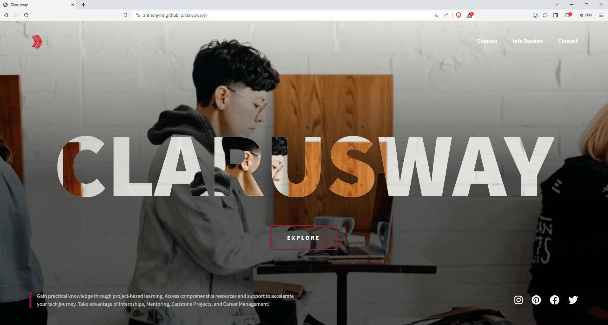

Clarusway

## Project : Clarusway Page

## Description
Project aims to create the same of given page (Clarusway page).

## Problem Statement

- Your company has recently started on a project that aims to create their web page. So you and your colleagues have started to work on the project.

## Figma Page

- [You can visit the figma page](https://www.figma.com/file/1jFg3VK9CVSGaEM2xAdxHx/Clarusways?type=design&node-id=0%3A1&mode=design&t=qMvXzJQ8woHk21za-1)

## Expected Outcome

## Objective

Build a page that is functionally similar to this: [Clarusway Project](https://anthonyins.github.io/clarusways/)

### At the end of the project, following topics are to be covered;

- HTML 
- Css
  - CSS Media Query
  - CSS Flex
  - CSS backgrund

### At the end of the project, students will be able to;

- improve coding skills within HTML & CSS

- use git commands (push, pull, commit, add etc.) and Github as Version Control System.

## Notes

- You can use HTML,and CSS to complete this project.

## Resources

-  [Image](./image)